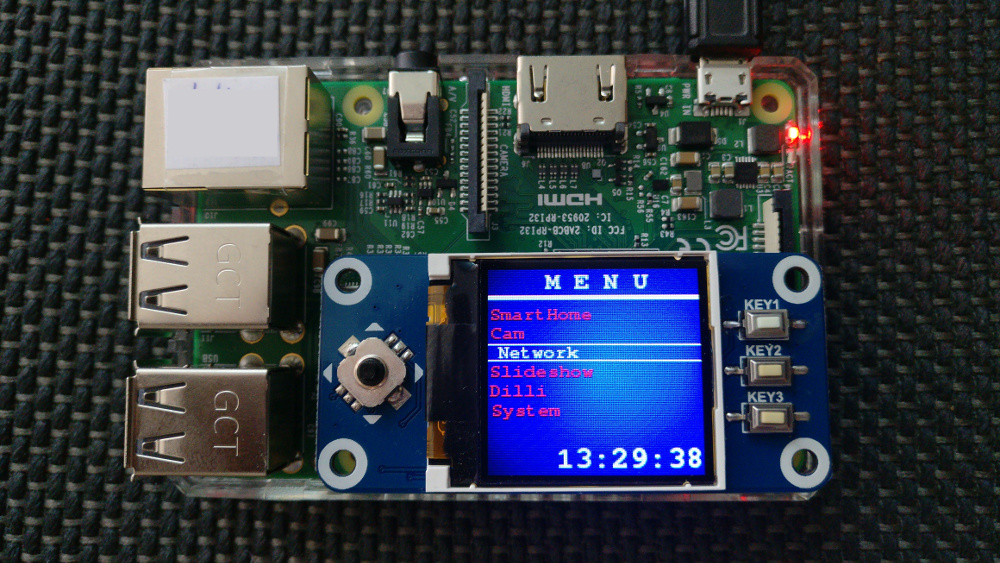

# LCDisplay
<a href="https://www.amazon.de/gp/product/B077YK8161">Waveshare Raspberry Pi 128x128 Pixels 1.44inch LCD Display Hat </a>
<table>
    <tr>
        <td></img></td>
    </tr>
</table>

pip3 install netifaces
