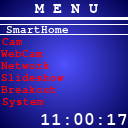
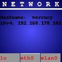
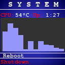
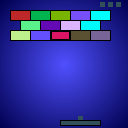

# LCDisplay
<a href="https://www.amazon.de/gp/product/B077YK8161">Waveshare Raspberry Pi 128x128 Pixels 1.44inch LCD Display Hat </a>
<table>
    <tr>
        <td></img></td>
    </tr>
</table>
 
 
<table>
    <tr>
        <td></td>
        <td></td>
        <td></td>
        <td></td>
    </tr>
</table>
 
 
pip3 install paho-mqtt
pip3 install websockets
pip3 install netifaces
pip3 install lxml requests
pip3 install fritzconnection
